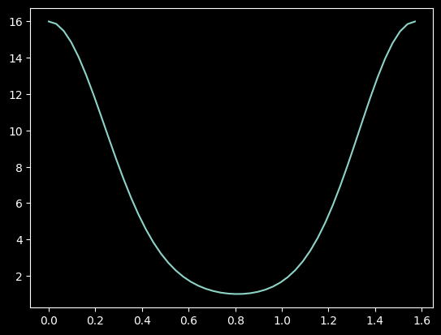

# time_evolution

A mini project.

### Problem

Using quantum circuits to simulate a quantum system is one of the original purposes of quantum computing. Please describe how to construct a quantum circuit to simulate a physical system evolution in Hamiltonian:
$$
\hat{H}=\sum_{k=1}^{N-1}J_k(\sigma^x_k\sigma^x_{k+1}+\sigma^y_k\sigma^y_{k+1}), \quad J_k=\sqrt{k(N-k)}
$$
For $t=\pi/2$, where the initial state is $\ket{\psi(t=0)}=\ket{10\cdots0}_N$

In this project, Qiskit will be used, and the results will be compared with analytical ones.

### Result

Trotter-Suzuki decomposition formula is used.

The time evolutions are shown below. (left: qiskit, right: Julia).

Please find the more details through the links: [↗️qiskit](qiskit ./qiskit_evolution.ipynb ) and [↗️Julia](qiskit ./Julia_evolution.ipynb).

